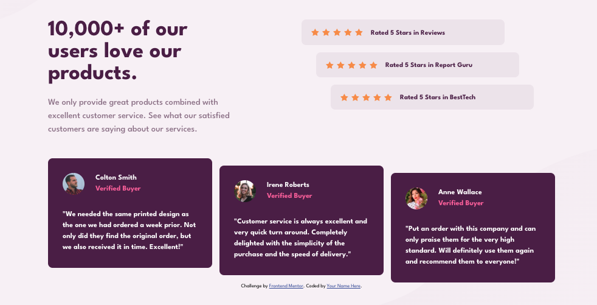

# Frontend Mentor - Social proof section solution

This is a solution to the [Social proof section challenge on Frontend Mentor](https://www.frontendmentor.io/challenges/social-proof-section-6e0qTv_bA). Frontend Mentor challenges help you improve your coding skills by building realistic projects.

## Table of contents

- [Overview](#overview)
  - [The challenge](#the-challenge)
  - [Screenshot](#screenshot)
  - [Links](#links)
- [My process](#my-process)
  - [Built with](#built-with)
  - [What I learned](#what-i-learned)
  - [Continued development](#continued-development)
  - [Useful resources](#useful-resources)
- [Author](#author)
- [Acknowledgments](#acknowledgments)

## Overview

### The challenge

Users should be able to:

- View the optimal layout for the section depending on their device's screen size

### Screenshot

### Links

- Solution URL: [Github Link](https://github.com/NatnaelSisay/social-proof-section-master)
- Live Site URL: [Netlify Link](https://warm-khapse-b4523b.netlify.app/)

## My process

### Built with

- Semantic HTML5 markup
- CSS custom properties
- Flexbox
- CSS Grid
- Mobile-first workflow
- [SCSS](https://sass-lang.com/)

### What I learned

Learned how to better organize my SASS files for better modularity.
And also how to break large user interface down to single pupose small component.

### Continued development

On some situations I haven't separated the Layout from the style and theme, which can be better improved.

### Useful resources

- [Josh Comeau](https://www.joshwcomeau.com/css/custom-css-reset/) - The perfect place for CSS Rest.
- [Sass Guidelines](https://sass-guidelin.es/#architecture) - good understaing on how to organize sass files in multiple modules.

## Author

- LinkedIn - [Natnael Kagnaw](https://www.linkedin.com/in/natnael-kagnaw/)
- Frontend Mentor - [@NatnaelSisay](https://www.frontendmentor.io/profile/NatnaelSisay)

## Acknowledgments

I would like to thank Front-end mentor and the discord community and Also [Kevin Powell](https://www.youtube.com/@KevinPowell) from YouTube.
